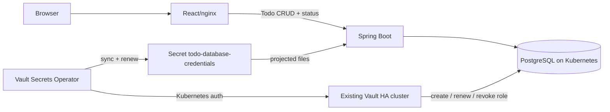

# Kubernetes + external Vault + VSO demo

Todo app này được chia thành hai giai đoạn độc lập để dễ demo và dễ xác định lỗi:

1. Deploy PostgreSQL, Spring Boot backend và React frontend lên cụm Kubernetes
   có sẵn. App dùng một bootstrap credential trong Kubernetes Secret.
2. Kết nối cụm Vault có sẵn bằng Vault Secrets Operator (VSO). VSO lấy dynamic
   PostgreSQL credential, ghi đè vào chính Secret trên và backend hot-swap
   connection pool mà không restart Pod.

Backend không giữ Vault token và không gọi Vault API. UI hiển thị DB username,
password fingerprint và thời điểm renew/rotate ước tính. Mật khẩu thô không được
trả về trình duyệt; fingerprint đổi là bằng chứng password đã rotate.



## Điều kiện trước khi chạy

Cần có `docker`, `kubectl`, `helm`, `vault`, `jq`, `openssl` và quyền quản trị
phù hợp trên Kubernetes/Vault. Kubernetes cần một default StorageClass để cấp
PVC 5 GiB cho PostgreSQL.

Ba đường mạng sau phải thông:

- VSO Pod trong Kubernetes → Vault API `:8200`.
- Các Vault node → Kubernetes API để gọi TokenReview.
- Các Vault node → PostgreSQL `:5432` để Vault tạo và thu hồi login role.

Copy cấu hình mẫu và thay các giá trị placeholder:

```bash
cp .env.example .env
```

`VAULT_ADDR` là endpoint dùng bởi Vault CLI. Nếu Pod trong cluster phải dùng
endpoint khác, đặt thêm `VSO_VAULT_ADDR`. Với TLS private CA, đặt
`VAULT_CACERT` tới file CA local. `VAULT_SKIP_VERIFY=true` chỉ phù hợp lab tạm.

## Giai đoạn 1 — chạy app bằng bootstrap credential

### 1. Build và đưa image tới cluster

Nếu cluster dùng được image local, chạy:

```bash
make images
```

Với cluster remote, dùng registry mà các node pull được:

```bash
make images \
  BACKEND_IMAGE=registry.example.com/lab/todo-backend:demo \
  FRONTEND_IMAGE=registry.example.com/lab/todo-frontend:demo
docker push registry.example.com/lab/todo-backend:demo
docker push registry.example.com/lab/todo-frontend:demo
```

### 2. Tạo Secret và deploy

```bash
make lab-secrets
make app-deploy \
  BACKEND_IMAGE=registry.example.com/lab/todo-backend:demo \
  FRONTEND_IMAGE=registry.example.com/lab/todo-frontend:demo
make app-status
```

Nếu dùng image local, bỏ hai biến image ở lệnh `make app-deploy`. Sau đó mở UI:

```bash
make port-forward
# http://127.0.0.1:8081
```

Thêm, sửa và xoá vài todo. Panel credential lúc này phải hiện
`todo_bootstrap`, nguồn `Bootstrap Secret/...` và trạng thái `STATIC`. Như vậy
ta đã chứng minh app/Kubernetes/PostgreSQL hoạt động trước khi đưa Vault vào.

## Giai đoạn 2 — chuyển sang dynamic credential bằng VSO

### 1. Cho Vault kết nối tới PostgreSQL

Ưu tiên private LoadBalancer hoặc route riêng. Repo có NodePort `30432` chỉ để
demo trong mạng lab tin cậy:

```bash
make postgres-expose
# .env: VAULT_DB_ADDRESS=<k8s-node-ip>:30432
```

Đăng nhập Vault bằng token có quyền cấu hình auth method, database engine và
policy, rồi cấu hình database secrets engine:

```bash
vault login
make vault-db
make vault-smoke
```

Smoke test xin một credential, đăng nhập PostgreSQL, tạo bảng tạm, revoke lease
và xác nhận credential cũ không còn dùng được.

### 2. Cài VSO và Kubernetes auth

```bash
make vso-install
make vault-k8s-auth
```

Nếu endpoint trong kubeconfig là `127.0.0.1`/`localhost`, đặt
`KUBERNETES_HOST_FOR_VAULT` trong `.env` thành Kubernetes API endpoint mà các
Vault node truy cập được.

### 3. Bật đồng bộ dynamic credential

```bash
make vso-apply
make disable-bootstrap
```

`vso-apply` tạo `VaultConnection`, `VaultAuth` và `VaultDynamicSecret`, sau đó
chờ VSO đổi Secret từ `todo_bootstrap` sang dynamic username. Marker
`managed_by=vso` bật phần hiển thị lease trên UI. Chỉ chạy
`disable-bootstrap` sau khi bước này thành công.

Theo dõi quá trình:

```bash
kubectl -n vault-demo get vaultconnection,vaultauth,vaultdynamicsecret
kubectl -n vault-demo describe vaultdynamicsecret todo-database
kubectl -n vault-demo get events --sort-by=.lastTimestamp
kubectl -n vault-demo logs -f deployment/backend
```

Role mặc định có TTL 30 giây, max TTL 2 phút và VSO renew ở 67% TTL. Renew giữ
nguyên username/password; khi không thể renew tiếp, VSO lấy credential mới,
cập nhật Secret và backend validate/swap Hikari pool. Thời gian trên UI là ước
tính; event của VSO và thay đổi username/fingerprint là bằng chứng thực tế.

Muốn xem password thô trong terminal dành riêng cho lab:

```bash
kubectl -n vault-demo get secret todo-database-credentials \
  -o jsonpath='{.data.password}' | openssl base64 -d -A; echo
```

Không đưa lệnh này vào pipeline/log production.

## Bố cục repo

- `k8s/base/`: PostgreSQL, backend và frontend — không phụ thuộc VSO CRD.
- `k8s/vso/`: tài nguyên chỉ dùng ở giai đoạn tích hợp Vault.
- `k8s/addons/postgres-nodeport.yaml`: exposure tùy chọn cho lab.
- `scripts/`: tạo Secret, cấu hình Vault database/Kubernetes auth và smoke test.
- `infra/vault/bootstrap/`: SQL template và Vault policy.

API chính:

- `GET/POST /api/todos`
- `PUT/DELETE /api/todos/{id}`
- `GET /api/vault/status`
- `GET /actuator/health/liveness`
- `GET /actuator/health/readiness`

## Reset lab

Xóa namespace sẽ xóa cả PostgreSQL PVC và toàn bộ dữ liệu todo:

```bash
kubectl delete namespace vault-demo
```

Vault database engine, policy và auth mount không bị xóa bởi lệnh trên. Có thể
chạy lại các script vì chúng được viết theo hướng idempotent; việc dọn cấu hình
trên Vault nên làm thủ công theo quy trình quản trị của cụm hiện có.

Tài liệu tham khảo chính thức: [VaultDynamicSecret](https://developer.hashicorp.com/vault/docs/deploy/kubernetes/vso/sources/vault),
[VSO API reference](https://developer.hashicorp.com/vault/docs/deploy/kubernetes/vso/api-reference)
và [database secrets engine](https://developer.hashicorp.com/vault/docs/secrets/databases).
