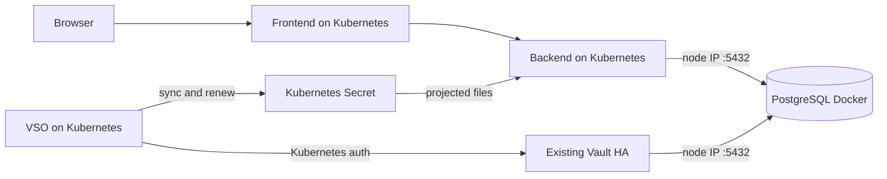

# Kubernetes app + Docker PostgreSQL + external Vault VSO

Kiến trúc của bài lab:

- Cụm Kubernetes có sẵn: chạy React frontend, Spring Boot backend và VSO.
- Docker host/node: chạy PostgreSQL container, publish cổng `5432` ra node.
- Cụm Vault HA có sẵn: quản lý dynamic PostgreSQL credentials.

Bài lab được chia làm hai phase. Phase 1 chứng minh Todo app kết nối PostgreSQL
bằng bootstrap credential. Phase 2 để VSO thay credential đó bằng dynamic
credential từ Vault mà không restart backend.



Backend không gọi Vault API. Nó đọc Secret dạng projected files và hot-swap
Hikari pool khi VSO đổi username/password. UI hiển thị username, password
fingerprint và thời điểm renew/rotate ước tính; password thô không được trả về
trình duyệt.

## Điều kiện mạng

Cần có `docker compose`, `kubectl`, `helm`, `vault`, `jq`, `openssl` và registry
image mà Kubernetes pull được.

Các đường mạng phải thông:

- Backend Pod → IP node chạy Docker, cổng PostgreSQL `5432`.
- Các Vault node → cùng endpoint PostgreSQL đó.
- VSO Pod → Vault API `:8200`.
- Các Vault node → Kubernetes API để gọi TokenReview.

Nếu Docker và Kubernetes không nằm cùng máy, `APP_DB_HOST` phải là IP routable
của Docker host, không dùng `127.0.0.1`. Mở firewall `5432` chỉ cho Kubernetes
nodes và Vault nodes.

## Cấu hình

```bash
cp .env.example .env
```

Các biến cần thay:

```dotenv
POSTGRES_ADMIN_PASSWORD=<admin-password>
TODO_BOOTSTRAP_PASSWORD=<bootstrap-password>

# IP node/host chạy Docker mà Kubernetes Pod truy cập được
APP_DB_HOST=192.168.1.10
APP_DB_PORT=5432

# Cùng endpoint nhưng được nhìn từ các Vault node
VAULT_DB_ADDRESS=192.168.1.10:5432

VAULT_ADDR=https://vault.example.com:8200
```

Với Docker Desktop, `APP_DB_HOST=host.docker.internal` có thể dùng được. Với
cluster remote, phải dùng IP/DNS thực sự route được đến Docker host.

## Phase 1 — PostgreSQL Docker và app Kubernetes

### 1. Khởi động PostgreSQL

```bash
make postgres-up
make postgres-status
```

Compose dùng `postgres:16-alpine`, volume `postgres_data`, database `todo` và
publish `${POSTGRES_BIND_ADDRESS:-0.0.0.0}:${POSTGRES_PORT:-5432}`. Init script
tạo:

- `todo_app`: NOLOGIN role ổn định, sở hữu schema/object.
- `todo_bootstrap`: LOGIN role ban đầu, được grant `todo_app`.

Xem log khi cần:

```bash
make postgres-logs
```

### 2. Build và push image

```bash
make images \
  BACKEND_IMAGE=registry.example.com/lab/todo-backend:demo \
  FRONTEND_IMAGE=registry.example.com/lab/todo-frontend:demo

docker push registry.example.com/lab/todo-backend:demo
docker push registry.example.com/lab/todo-frontend:demo
```

Nếu cluster dùng được image local thì có thể giữ tên mặc định.

### 3. Deploy frontend và backend

```bash
make lab-secrets
make app-deploy \
  BACKEND_IMAGE=registry.example.com/lab/todo-backend:demo \
  FRONTEND_IMAGE=registry.example.com/lab/todo-frontend:demo
make app-status
```

`app-deploy` lấy `APP_DB_HOST`/`APP_DB_PORT` từ `.env`, cập nhật ConfigMap và
restart backend để Pod kết nối PostgreSQL Docker.

```bash
make port-forward
# http://127.0.0.1:8081
```

Thêm, sửa, xoá todo. Panel credential phải hiện `todo_bootstrap`, nguồn
`Bootstrap Secret/...` và trạng thái `STATIC`.

## Phase 2 — tích hợp Vault bằng VSO

Đăng nhập Vault bằng token có quyền cấu hình database secrets engine, auth
method và policy:

```bash
vault login
make vault-db
make vault-smoke
```

`vault-smoke` xin credential động, dùng credential đó kết nối vào PostgreSQL
container, revoke lease rồi xác nhận login đã bị thu hồi.

Cài VSO và cấu hình Kubernetes auth:

```bash
make vso-install
make vault-k8s-auth
```

Nếu kubeconfig dùng API endpoint `127.0.0.1`/`localhost`, đặt
`KUBERNETES_HOST_FOR_VAULT` thành endpoint mà Vault nodes truy cập được.

Bật dynamic secret:

```bash
make vso-apply
make disable-bootstrap
```

VSO đọc `database/creds/todo-app`, cập nhật Secret
`todo-database-credentials` và thêm marker `managed_by=vso`. Backend nhận thay
đổi file, validate credential rồi chuyển connection pool. Chỉ disable
`todo_bootstrap` sau khi `vso-apply` thành công.

Theo dõi:

```bash
kubectl -n vault-demo get vaultconnection,vaultauth,vaultdynamicsecret
kubectl -n vault-demo describe vaultdynamicsecret todo-database
kubectl -n vault-demo get events --sort-by=.lastTimestamp
kubectl -n vault-demo logs -f deployment/backend
```

TTL mặc định là 30 giây, max TTL 2 phút, VSO renew ở 67% TTL. Renew giữ nguyên
username/password; khi lease không renew tiếp được, VSO lấy credential mới và
cập nhật Secret.

Xem password thật trong terminal dành riêng cho lab:

```bash
kubectl -n vault-demo get secret todo-database-credentials \
  -o jsonpath='{.data.password}' | openssl base64 -d -A; echo
```

## Chuyển từ bản cũ có PostgreSQL trên Kubernetes

Manifest mới không còn deploy PostgreSQL. Nếu tài nguyên cũ vẫn tồn tại, có thể
xóa workload/service cũ sau khi đã xác nhận Docker PostgreSQL hoạt động:

```bash
kubectl -n vault-demo delete statefulset postgres service postgres \
  service postgres-vault configmap postgres-init --ignore-not-found
```

PVC cũ có thể vẫn giữ dữ liệu. Chỉ xóa khi chắc chắn không cần phục hồi:

```bash
kubectl -n vault-demo delete pvc data-postgres-0
```

## Reset

Dừng PostgreSQL nhưng giữ dữ liệu:

```bash
make postgres-stop
```

Xóa container và volume PostgreSQL — thao tác này mất toàn bộ todo:

```bash
docker compose down -v
```

Xóa app/VSO resources trong namespace:

```bash
kubectl delete namespace vault-demo
```

Vault database engine, policy và auth mount không bị xóa tự động.

Tài liệu chính thức: [VaultDynamicSecret](https://developer.hashicorp.com/vault/docs/deploy/kubernetes/vso/sources/vault),
[VSO API reference](https://developer.hashicorp.com/vault/docs/deploy/kubernetes/vso/api-reference)
và [Vault database secrets engine](https://developer.hashicorp.com/vault/docs/secrets/databases).
